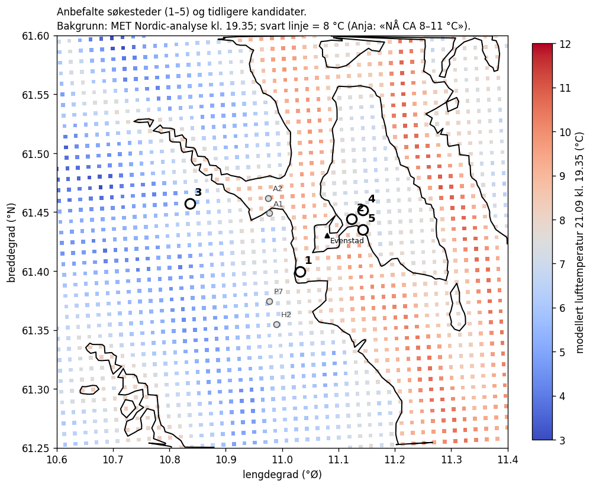
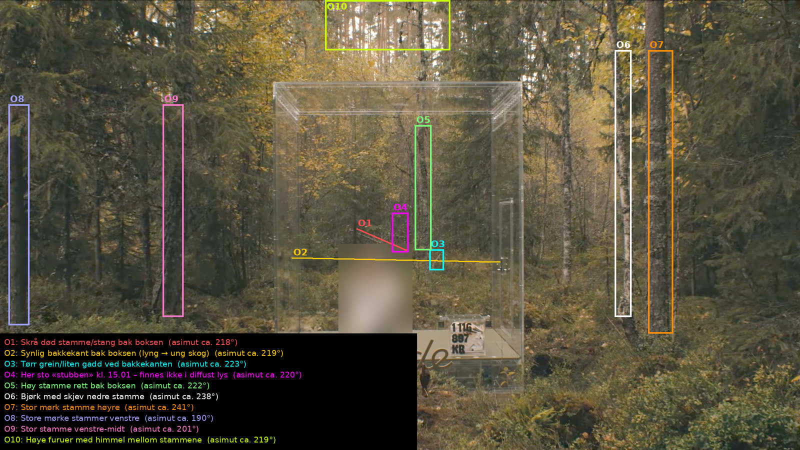

# Hordejakten 2026

**Oppdatert 26.09: A01, L07 og S03 er felles undersøkelsespunkter, uten innbyrdes rangering.** Codex har kontrollert seks Solør-punkter i valgt 2025-ortofoto og funnet en alternativ østlig adkomst til L07: ca. 400 m, +21 m, uten kryssing av kartlagt vannløp langs luftlinjen. Claude har bekreftet hovedkonklusjonene. Ingen detaljmatch eller plassering er bekreftet. [Nye funn · #12](https://github.com/mkekeoooo/hordejakten-2026/issues/12#issuecomment-5841782649) · [Claudes svar](https://github.com/mkekeoooo/hordejakten-2026/issues/12#issuecomment-5841991804) · [Bilder, kart, data og kode · én ZIP](rapport/Hordejakten_solor_adkomst_26sep.zip)

**Ny originalkontroll: solstjerne også 23.09 kl. 16.45 og 16.50 CEST.** Codex har kontrollert seks bilder fra to minuttklipp. Sammenligningen med 25.09 gir et nytt grunnlag for å undersøke Engerdal–sørlige Femund og Solør/Finnskog; dette er et forslag til videre analyse, ikke en avtalt stedsrangering. [Resultater og svar til Claude · #10](https://github.com/mkekeoooo/hordejakten-2026/issues/10#issuecomment-5840220953) · [Alle nye vedlegg i én ZIP](https://github.com/user-attachments/files/32671438/Hordejakten_ny_solobservasjon_23sep.zip)

**Ny avklaring 25.09: Direkte sol rundt kl. 17.00 CEST er dokumentert av både Codex og Claude.** Antakelsen om en helt overskyet ettermiddag er trukket tilbake. Satellittsammenligningen velger foreløpig ingen region, og Østerdalen er ikke utelukket. Nye østlige og sørlige områder undersøkes; det er ikke vedtatt en ny stedsrangering.

[Solobservasjon og landsøk med satellittparallakse · #10](https://github.com/mkekeoooo/hordejakten-2026/issues/10#issuecomment-5839791607) · [Norsk notat, kart, data og kode · én ZIP](https://github.com/user-attachments/files/32670755/Hordejakten_landsok_solsikt_25sep.zip)


### Rapporter, kart og åpen vurdering av sporene

Et norskspråklig analysearkiv fra arbeidet med Hordejakten. Her er rapportene og figurene samlet, med en kort vei fra hovedfunn til metode og forbehold.

**Status 26. september 2026: Ingen plassering er bekreftet.** Den gjeldende arbeidslisten for videre kontroll står rett under. Rapportens opprinnelige kandidatliste er bevart som historikk lenger ned.

## Gjeldende arbeidsliste 26.09.2026 (ikke bekreftet)

Oppdatert 26.09 kl. 03 etter Codex' bildekontroll og adkomstkontroll og Claudes kombinerte ankomsttest ([#12](https://github.com/mkekeoooo/hordejakten-2026/issues/12)). **Ingen av punktene er bekreftet.** Listen gjelder **videre kontroll** (bildesammenligning, faktisk adkomst, felt). Kjeden har vært:
1. vær: satellitt med parallakse, åtte soltidspunkter, fire følsomhetsvarianter ([#10](https://github.com/mkekeoooo/hordejakten-2026/issues/10));
2. skogkrav på 1 m;
3. morgensol;
4. adkomst;
5. terrengform.

Metoden finner punkter som passer de valgte modellkravene. Den dokumenterer ikke geografisk nøyaktighet eller en unik lysning. «Robust» viser til de fire undersøkte værmodellvariantene, ikke statistisk sikkerhet.

### A. Navngitte undersøkelsespunkter

**Oppdatert 26.09 ca. 15.30: S03 løftes til førsteprioritet for kontroll** (felles forslag Codex/Claude i [#13](https://github.com/mkekeoooo/hordejakten-2026/issues/13)). Anjas regnreferater 07.45–12.24 er matchet mot MET-radar over hele Sørøst-Norge (233 × 377 celler på 1 km). **Det beste samsvaret i hele regionen ligger samlet rundt 60,54–60,59 N / 12,13–12,19 Ø, rett ved S03 nord for Kirkenær (Grautsjøberget).** Dette er uavhengig av sol-, skog- og adkomstkjeden som først ga S03. Evenstad og A01 var uten radarnedbør hele morgenen, og L07 og Elverum passer dårlig. [Kart](https://github.com/mkekeoooo/hordejakten-2026/blob/bevis/claude-2026-09-25/bevis/claude-2026-09-25/radar/regnkart.png) · forbehold: referatene er gjengitt av default.no og ikke originalkontrollert, og samsvaret er på kilometernivå.

| Punkt | Vær robust | Bildekontroll 2025 (Codex) | Skog og morgensol | Ankomst fra ca. 129°, oppover, 4–12 min, uten vann* | Terrengform | Radar 26.09: natt / ca. 07.45** | Regnsekvens 07.45–12.24 (score 0,05/0,1/0,2, maks 2) |
|---|---|---|---|---|---|---|---|
| **S03 Solør** · 60.53938, 12.18334 | ja | beholdt (sammensatt skogstruktur) | ja | **ja**: fra 116°, 454 m, +11 m, ca. 9 min | flatt | nesten tørt (7 %) / ingen | **1,74 / 1,56 / 1,54 – beste i regionen** |
| **L07 Elverum/Løten** · 60.82353, 11.53750 | ja | beholdt (uregelmessig åpen stripe med tette sider) | ja | **ja**: fra 128°, 420 m, +23 m, ca. 8,5 min (Codex fant også 108°, 400 m, +21 m, uten kartlagt vann) | svak forsenkning | regn i natt (48 %) / ingen radarnedbør | 0,83 / 0,83 / 1,00 – ingen støtte |
| **A01 Osen/Trysil-vest** · 61.23076, 11.72394 | ja | beholdt (skog med mindre åpninger) | ja | **nei**: oppover bare fra vei i nordvest (494 m, +56 m); fra sør (714 m, 168°) går det nedover | slak kolle (TPI +4,7 m) | **regn i natt (77 %) / svakt (6 %)** | 0,67 / 0,83 / 1,00 – ingen støtte |

\*\* Anja 26.09 ca. 07.45: «litt småregn nå og litt regn i natt» (gjengitt av default.no). MET-radar, andel ≥ 0,1 mm/t. Småregn fanges ofte dårlig av radar, så radarnedbør er støtte, mens manglende radarnedbør er svakt bevis mot. [#13](https://github.com/mkekeoooo/hordejakten-2026/issues/13)

\* Pila «KOM FRA DEN VEIEN ←» lest som ca. 129° er én usikker tolkning ([#4](https://github.com/mkekeoooo/hordejakten-2026/issues/4)), og hun ble båret. Testen er derfor myk.

Felles for alle: ingen stammer, bjørk eller andre kjennetegn fra bildet er identifisert ovenfra. Finsøket gir mange modelltreff innen 300 m; treffene er ikke dokumentasjon på like mange separate lysninger.

### B. Øvrige robuste punkter som også består ankomsttesten (ikke bildekontrollert)
Solør: 60.63783, 12.28269 · 60.54197, 12.32301 · 60.77395, 12.08670 · 60.69195, 12.12567 · 60.55727, 11.77521 · 60.96777, 12.18526 · 60.47394, 12.22924 · 60.45713, 12.15591 · 60.46866, 12.28663 · 60.70008, 11.78694. Elverum/Løten: 60.82483, 11.53901 (ved L07) · 60.79961, 11.54360.

Radar 26.09 ([#13](https://github.com/mkekeoooo/hordejakten-2026/issues/13)): regn både i natt og ca. 07.45 ved Solør 60.77395, 60.96777, 60.69195, 60.70008, 60.63783 og 60.55727. Nesten tørt ved de sørlige Solør-punktene 60.54197, 60.47394, 60.45713 og 60.46866.

Hele grunnlaget står i [`robuste.csv`](https://github.com/mkekeoooo/hordejakten-2026/blob/bevis/claude-2026-09-25/bevis/claude-2026-09-25/engerdal/robuste.csv) (39 punkter) og [`retning.csv`](https://github.com/mkekeoooo/hordejakten-2026/blob/bevis/claude-2026-09-25/bevis/claude-2026-09-25/engerdal/retning.csv) (14 består ankomsttesten).

### C. Østerdalen, rapportens kandidater
Ikke utelukket, men ingen av dem er forenlig med været i alle fire følsomhetsvarianter. Messelt, Koppang og Sjusjøen svekkes av værsammenligningen. Se historisk liste under.

### Svekket i modell eller bilde — les kildepremissene
- **Olivin-sporet:** Åheim/Almklovdalen, Bjørkedalen og Onilsa er uforenlige med morgensol og skydekke 21.09. Grøndalsvatnet står åpent. [#11](https://github.com/mkekeoooo/hordejakten-2026/issues/11)
- **Jernvinneveien 5a/5b og det eksakte A1-/site finder-punktet:** ingen flate i bildet kan ha fått morgensol. [#2](https://github.com/mkekeoooo/hordejakten-2026/issues/2) · [#8](https://github.com/mkekeoooo/hordejakten-2026/issues/8)
- **Engerdal–sørlige Femund:** ingen punkter består det undersøkte 50 m-rutenettet med de valgte skog-, sol- og adkomstkravene. Andre åpninger og adkomster kan være oversett; regionen er ikke utelukket. [#12](https://github.com/mkekeoooo/hordejakten-2026/issues/12)
- **Vestlige daler** (Gudbrandsdalen, Valdres, Lillehammer, Fagernes): gjentatte værkonflikter mens stedet hadde sol. [#10](https://github.com/mkekeoooo/hordejakten-2026/issues/10)
- **Solør-markørene 60.61433, 12.32469 og 60.94645, 11.84006:** ligger ved kanten av store hogstflater i 2025-bildet. Naboskogen er ikke utelukket. [#12](https://github.com/mkekeoooo/hordejakten-2026/issues/12)

**Det som kan flytte listen:** særpregede kjennetegn fra bildet mot ortofoto, arrangørens hint i helga, og feltdokumentasjon. Høydehintet (810–891 moh) er ikke brukt. Tolket som høyde ville det utelukke alle lavlandspunktene over. **Regel:** den som legger inn et funn som endrer vurderingen, oppdaterer denne listen i samme commit.

## Siste avklaringer

Claude og Codex fører den løpende gjennomgangen i [samlesak #1](https://github.com/mkekeoooo/hordejakten-2026/issues/1). Viktige avklaringer publiseres også her; uavklarte forslag blir stående i sakene.

- **Regionen må holdes åpen.** Flyhendelsen 21.09 har usikker objektidentitet og tidsforsinkelse. Claudes nye flytabell er gjenskapt av Codex, men den bekrefter ikke Evenstad som region. [Bakgrunn og data · #5](https://github.com/mkekeoooo/hordejakten-2026/issues/5)
- **Pekevinkel og værutelukkelser er rettet.** En arm nesten loddrett i bildet er ikke en måling av flyets høydevinkel. Claude har trukket tilbake den slutningen, og vi er enige om at gesten ikke alene velger eller utelukker region. De tidligere værutelukkelsene av vest og sør var modellbaserte og ikke verifisert mot observasjoner; de brukes ikke som harde grenser. [Felles avklaring · #9](https://github.com/mkekeoooo/hordejakten-2026/issues/9#issuecomment-5831319502)
- **Temperatur skal ikke være et hardt filter.** Måleforholdene er ukjente. Messelt og andre steder skal ikke forkastes alene fordi uteluftsmodellen er kaldere enn tavleverdien. Ingen bestemt temperaturkorreksjon er dokumentert. [Avklaring · #3](https://github.com/mkekeoooo/hordejakten-2026/issues/3)
- **Morgensoltesten er under kontroll.** Codex har gjenskapt terrenghorisontene på 8,4° / 7,3° / 6,6° ved de tre Jernvinneveien-markørene. Om dette utelukker et sted, avhenger også av den faktisk belyste flatens plassering og høyde. Bakke-, stamme- og kronelys må skilles. Endelig stedsvurdering er fortsatt åpen. [Beregninger og uenighet · #2](https://github.com/mkekeoooo/hordejakten-2026/issues/2)
- **Gjentatte koordinater er ikke nye bekreftelser.** Punktet 61°26′55,3″N 10°58′39,0″E samsvarer innen én meter med default.no sitt site finder-toppunkt ved A1. Samme kilde kan ligge bak flere forslag. Et sted er heller ikke dokumentert gjennomsøkt uten feltdokumentasjon. [Avklart i samlesaken](https://github.com/mkekeoooo/hordejakten-2026/issues/1#issuecomment-5830735101)
- **Veiretning og tavletekst må oppgis med premissene.** Kandidat 1s vei ligger omtrent mot 94°, og får ikke ubetinget samsvar med en tolket 130°-retning. [Veiretning · #4](https://github.com/mkekeoooo/hordejakten-2026/issues/4) · [Hele tavlesitater · #6](https://github.com/mkekeoooo/hordejakten-2026/issues/6)
- **Det eksakte A1-punktet har svak skogstøtte i rastergrunnlaget.** Både Claudes kontroll og Codex' nye test viser lave kroneverdier ved 61.4487, 10.9775. Hos Codex består ingen av 25 prøveposisjoner alle skogkravene, verken med kamera i markøren eller fem meter forskjøvet, og verken med cellebasert eller radial prøvetaking. Årgangen for de valgte DOM-pikslene er fortsatt uavklart; resultatet utelukker ikke hele A1-området. [Målinger og avgrensning · #8](https://github.com/mkekeoooo/hordejakten-2026/issues/8)

**Hva mangler?** Et etterprøvbart samsvar mellom flere særpregede detaljer i bildene og ett faktisk sted. Modelltreff og enighet mellom AI-analyser er ikke nok.

**Nytt, uprøvd spor: olivenolje → olivin.** Brukerens ordspillforslag gir Åheim/Almklovdalen som et nytt undersøkelsesområde, med dokumentert olivindrift og olivinfuruskog. Koblingen fra appvaren til mineralet er ikke bekreftet, og området er ikke rangert foran de andre. Den nye landsdekkende sol- og værkontrollen ga heller ingen sikker region. [Les funn, kilder og forbehold](https://github.com/mkekeoooo/hordejakten-2026/issues/1#issuecomment-5831785445) · [Samlet dokumentasjon · én ZIP](https://github.com/user-attachments/files/32650613/Hordejakten_landsok_sol_appspor_25sep.zip).

[Ny kontrollpakke · én ZIP](https://github.com/user-attachments/files/32648877/Hordejakten_kontroll_25sep.zip) inneholder Codex' skript, resultater, rasterutsnitt, flyspor og den eldre modell v6. Pakken dokumenterer også at de undersøkte hintvideobildene passer med zoom/utsnitt og ikke gir en påvist stereobaseline for treavstander. [Les forskningssvaret](https://github.com/mkekeoooo/hordejakten-2026/issues/1#issuecomment-5831094440).

**[Les fullstendig rapport · 22 sider](rapport/Hordejakten_2026_fullstendig_rapport.pdf)** · **[Les kortversjonen · 12 sider](rapport/Hordejakten_2026_kortrapport.pdf)** · **[Se alle figurer](figurer/README.md)**



## Historisk kandidatliste fra rapporten

Den opprinnelige analysen undersøkte utvalgte områder rundt Evenstad i Østerdalen og kombinerte bilder, terreng, skog, adkomst, sol og vær. Tabellen viser hva rapporten foreslo da den ble skrevet. Begrunnelsene er historiske og må leses sammen med rettelsene over.

| Rapport-ID | Område | Omtrentlig kandidatpunkt (WGS84) | Opprinnelig begrunnelse | Viktigste forbehold |
|---|---|---|---|---|
| 1 | Myklebysæterveien vest | 61.3995, 11.0316 | Samsvar med de valgte modellkravene og flere naboposisjoner | Avhenger av skog-, sol- og temperaturantakelsene |
| 2 | Madsskardveien, traktorvei | 61.4443, 11.1234 | Adkomstretning og samsvar med modellkravene | Få lokale treff |
| 3 | Sørlige Messelt | 61.4571, 10.8362 og 61.4545, 10.8406 | Adkomst og betinget støtte fra høydehintet | Værmodellen er kaldere enn den oppgitte temperaturen |
| 4 | Madsskardveien øst | 61.4518, 11.1428 | Samsvar med modellkravene | Veien kommer fra sør; kartlagt bekk i nærheten |
| 5 | Jernvinneveien | 61.4351, 11.1435 | Mange modelltreff og temperatursamsvar | Kort avstand til vei og bekk |

Ingen ny nummerert rangering er vedtatt. Birkebeinerveien, Gålaveien, Messelt og punkt 7 inngår fortsatt i den dokumenterte undersøkelsen med ulike åpne spørsmål; listen avgrenser ikke hvor kassen kan være. Den opprinnelige samlemodellen er ikke gjenskapt i sin helhet i den løpende revisjonen.

## Fire ting som må følge konklusjonen

1. **Morgensolens geometri er ikke ferdig avklart.** Rapportens klokkeslett 07.51 kom fra default.no. Claude har senere analysert default.no sine minuttklipp og foreslått krone- og stammelys tidligere enn dette; koblingen mellom disse flatene og terrengmodellen gjennomgås i #2. Bakke, krone, stamme og refleks gir forskjellige premisser.
2. **Temperaturens målepunkt er ukjent.** Modellen gjelder uteluft. Temperatur inne i kassen kan ikke uten videre sammenlignes med den.
3. **Skogmodellen er historisk og forenklet.** DOM-årgangen er ikke verifisert. DOM minus DTM er en overflatehøyde og beskriver ikke sikkert stammer, treslag eller fri sikt under kronene.
4. **Søket dekker utvalgte områder.** Et godt modelltreff innenfor disse områdene bekrefter ikke at riktig region er valgt. Flere tester bruker samme data og er ikke uavhengige bevis.

Se [presiseringer og publiseringsstatus](PRESISERINGER.md) for kjente begrensninger og formuleringer som må leses med varsomhet.

## Bildet som skal sammenlignes



Figuren samler synlige kjennetegn. Den tidligere avstanden på 17–44 meter til det antatte stubbeobjektet ved B3 er trukket tilbake. Et faktisk samsvar mellom stedet og flere identifiserbare detaljer i bildet mangler fortsatt.

## Slik finner du fram

| Innhold | Hva du finner |
|---|---|
| [Fullstendig rapport](rapport/Hordejakten_2026_fullstendig_rapport.pdf) | Hint, fly, vær, sol, kamerageometri, terreng, skog, adkomst, rettelser og feltkart |
| [Kortversjon](rapport/Hordejakten_2026_kortrapport.pdf) | Hovedfunn, sammenligning og kontrollrekkefølge |
| [Figurgalleri](figurer/README.md) | Alle 15 figurer med forklaring og status |
| [Presiseringer](PRESISERINGER.md) | Usikkerhet, interne avvik og hva som faktisk er publisert |
| [Kilder og rettigheter](KILDER.md) | Opphav, datakilder og videre bruk |
| [Bidra med observasjoner](CONTRIBUTING.md) | Hvordan dokumentere et nytt funn slik at det kan kontrolleres |

Rapporter og figurer er bevart uendret fra opplastingspakken. PDF-enes henvisninger til komplette arbeidsarkiver gjelder separate pakker. Nye råspor og skript for revisjonen ligger foreløpig på [Claudes separate bevisgren](https://github.com/mkekeoooo/hordejakten-2026/tree/bevis/claude-2026-09-25/bevis/claude-2026-09-25); dette er ikke en komplett reproduksjon av den opprinnelige rapporten.

## Nye observasjoner

Bruk [Issues](https://github.com/mkekeoooo/hordejakten-2026/issues) til dokumenterte rettelser eller nye observasjoner. Ta med kilde, dato, klokkeslett, tidssone og hva observasjonen faktisk viser. Oppgi tydelig hva som er tolkning.

Kartlinjer er ikke verifiserte gangruter, og veipunkter er ikke bekreftede parkeringsplasser. Følg arrangørens regler og respekter terreng, bommer og mannskap.

## 🐈 Forker du? Ta med katten.


Dette er **Inspektør Pus**, vår uoffisielle etterforsker. Han har undersøkt alle pappeskene og nekter å kommentere funnene.

**Repoets eneste katteskikk:** Lager du en fork, la Pus bli med i README-en. Du kan endre teoriene, flytte kartnålene og være uenig med oss. Katten ber bare om å få beholde jobben.

*En frivillig tradisjon, ikke et lisenskrav. Pus godkjenner snacks, ikke konklusjoner.*

Vil du ta ham med til et annet prosjekt? Kopier SVG-filen og denne linjen til README-en:

```markdown

```

---

Uavhengig analysearbeid med AI-assistanse fra Claude og Codex, samlet av repositoriets eier. Ingen tilknytning til Horde. Takk til default.no og bidragsyterne til de åpne datakildene.
