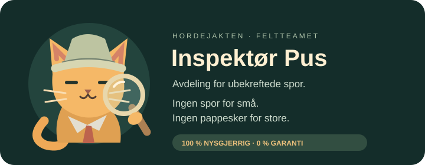

# Hordejakten 2026 — avsluttet jakt, læringsarkiv

**Status 29. september 2026:** Kassen er åpnet og jakten avsluttet. Vår undersøkelse fant ikke den eksakte plasseringen før åpningen. Dette repoet bevarer arbeidet, rettelsene og lærdommene for senere gjennomgang.

**Start her:** [Etterarbeid: hva vi gjorde og hvorfor søket sviktet](ETTERARBEID_2026-09-29.md) · [Koder og hint](KODER_OG_HINT.md) · [Arbeidsopplegg for neste jakt](NESTE_JAKT.md) · [Arkiv og reproduksjon](ARKIV_2026.md).

## Hva som er kjent, og hva som gjenstår

| Opplysning | Status ved arkivering |
|---|---|
| Kassen åpnet 29.09 | Observert på Hordes sending; arrangøren takket følgerne og varslet forklaring av hint og lokasjon. Nøyaktig åpningstid er ikke kalibrert. |
| 60.527694, 12.147639 | Koordinat publisert av en seer i skibens Twitch-chat. **Ikke offisielt bekreftet i dette arkivet.** |
| Avstand til S03 | 2,346 km til den rapporterte koordinaten. Dette er en etterberegning, ikke et funn under jakten. |
| Dørkode `Y2567` | Brukerens erindring 29.09: «Y2567 or something like that». **Omtrentlig og ubekreftet.** |
| `2023` / `5008` | Tidligere kodeopplysninger med ulik dokumentasjon; se kodeoversikten. Ingen fysisk låstest utført av oss. |
| Vinneridentitet / endelige hintforklaringer | Ikke offisielt verifisert her. Chattilnavn og streamtitler er ikke identitetsbekreftelse. |

Etterkontrollen viser en konkret svakhet: den rapporterte flekken falt under vår uvaliderte skogterskel; et nærliggende værforslag ble ikke detaljkontrollert; et senere nyhetssøk hoppet over land innen 4,5 km fra gamle kandidater. Dermed ble en nærliggende kartnål forvekslet med tilstrekkelig undersøkt område. [Full gjennomgang og tall](ETTERARBEID_2026-09-29.md).

## Bevarte rapporter og historikk

- [Samlet ny dokumentasjonspakke](Hordejakten_etterarbeid_29sep.zip): tidligere upubliserte notater, utvalgslogikk, resultater, små råuttrekk, kildehenvisninger og kjørbar etterkontroll.
- [README før etterarbeidet](README_historikk_28sep.md): bevart uendret, inkludert utdaterte prioriteringer og oversterke formuleringer. Den er historikk, ikke gjeldende fasit.
- [Opprinnelig full rapport](rapport/Hordejakten_2026_fullstendig_rapport.pdf) · [kortversjon](rapport/Hordejakten_2026_kortrapport.pdf) · [figurer](figurer/README.md).
- [Kilder og rettigheter](KILDER.md) · [tidligere presiseringer](PRESISERINGER.md) · [sakene og diskusjonene](https://github.com/mkekeoooo/hordejakten-2026/issues).

Gamle rapporter og saker er bevis på hva vi mente da. Les dem sammen med etterarbeidet; formuleringer som «eneste klynge», «uavhengig bekreftet» og bestemte høydefiltre er ikke en endelig konklusjon.

## Når arkivet tas fram igjen

Begynn med å dokumentere arrangørens endelige koordinat og kodeforklaring. Kjør avstandene og filterkontrollen på nytt dersom koordinaten avviker. Oppdater kilde- og sikkerhetsstatus uten å overskrive de opprinnelige observasjonene. Det er ingen aktiv leteoppgave eller automatisk overvåkning knyttet til denne overleveringen.

Inspektør Pus blir med videre. Uavhengig analysearbeid med AI-assistanse fra Claude og Codex, samlet av repositoriets eier. Ingen tilknytning til Horde.
