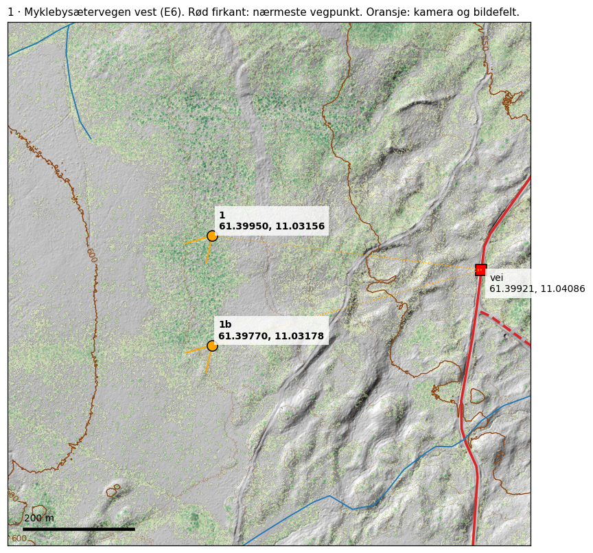

# Figurer og kart

Alle 15 originalfigurer fra publiseringspakken. Klikk på et bilde for full oppløsning. Illustrasjonene er modellresultater eller registrerte bildeobservasjoner; de dokumenterer ikke i seg selv plasseringen.

## Oversikt og feltkart

| Kart | Innhold |
|---|---|
| [Myklebysæterveien vest](kart_1_E6.png) | Rapportens kontrollområde 1 |
| [Madsskardveien, traktorvei](kart_2_E3.png) | Kontrollområde 2 |
| [Sørlige og nordlige Messelt](feltsone_Messelt_S1_S2_N1_N2.png) | S1, S2, N1 og N2 |
| [Madsskardveien øst](kart_4_E1.png) | Kontrollområde 4 |
| [Jernvinneveien](kart_5_E2.png) | Kontrollområde 5 |
| [Adkomst ved A2](bro_sjekk_A2.png) | Modell og kart over elv/ravine; ingen dokumentert trygg rute |

Veipunkter er ikke bekreftede parkeringsplasser. Prikkede forbindelser kan være luftlinjer, ikke stier.

## Bildeobservasjoner

| Figur | Innhold |
|---|---|
| [Kjennetegn kl. 10.45](fig_kjennetegn_1045.png) | Detaljer til sammenligning med et mulig sted |
| [Bakkepunkter i bildet](fig_bildemaling.png) | Bildekoordinater og vinkler |
| [Sammenligning av det antatte stubbeobjektet](fig_stubbe_sammenligning.png) | Grunnlag for å trekke tilbake den antatte B3-avstanden |
| [Stammeplassering](fig_stammeplassering.png) | Utforskende sammenligning med kronemodellen |
| [Lyshendelsen om natten](fig_lyshendelse.png) | Lysendring uten dokumentert geografisk retning |

## Modeller og historiske scenarioer

| Figur | Status |
|---|---|
| [Sol og temperatur](sol_og_temp.png) | Betingede modelltester; morgensol og temperaturreferanse er usikre |
| [Syntetisk utsyn](syntetisk_utsyn_kronebase40.png) | Illustrasjon med antatt kronebase; ikke en uavhengig bekreftelse |
| [Flyanalyse, 83 ruter](flykart_83ruter.png) | Historisk scenario avgrenset av høydehint og flyantakelser |

Gamle figurmarkeringer skal ikke gjeninnføre den tilbaketrukne B3-avstanden på 17–44 m. Se [presiseringene](../PRESISERINGER.md).
